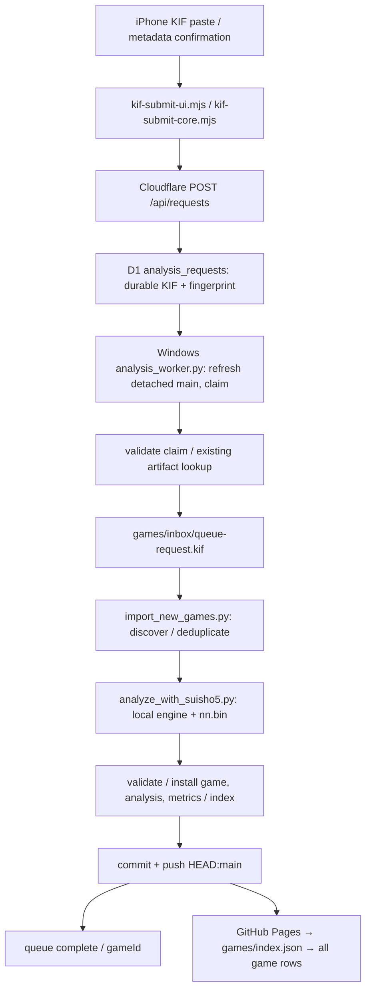

# Issue #41 — fresh audit / scroll / next-game HOME

- Audited: 2026-09-22 JST
- Fresh `git fetch origin main`: `462ab2c5a67c0000573f169c38207b1ac9bfc220`
- Branch: `issue-41-coach-scroll`
- Duplicate gate: OPEN PR 0. OPEN issues #41, #42, #43, #13, #12, #11, #10, #4, #3; #42/#43 cover separate features.
- Scope: P0-A audit, P0-B fix, P1 HOME. P0-A recovery remains unverified because queue access is unavailable. P2 interactive replay / P3 new progress model are outside this PR.

## Phase 0: confirmed data and limits

| Layer | Observed |
| --- | --- |
| Public catalog | 90 entries; latest 2026/09/19 HRyopiyo vs sonao81 |
| Saved KIF | 89 under games/; latest date 2026/09/19 |
| Game JSON | 89 under games/ plus legacy data.json (akane_20260910) |
| Analysis JSON | 90; all catalog references exist; no orphan top-level analysis |
| Local inbox | 0 KIF in development and configured worker checkouts |
| D1 saved source / queued / processing / failed / completed | **Unknown**, read-only remote SELECT rejected by Cloudflare account authorization (7403) |
| Windows worker at audit time | No Python/YaneuraOu process; no scheduled task matching shogi |
| Configured worker checkout | C:\Users\makiy\work\shogi-review-worker; detached 462ab2c; clean |
| Last GitHub success | Data commit 462ab2c at 2026-09-19 17:10:40 JST; Pages build succeeded |

There is no later KIF in the audited repository or these inboxes to recover. The legacy Akane record deliberately uses data.json and has no catalog KIF field; this explains the 89/90 difference, not a missing recent game.

**Confirmed:** this is not merely a 90-row display cap. No 90-game maximum was found in the repository search or queue/import/list code. `renderGameList` maps the complete catalog. `install_results` preserves existing entries and prepends new IDs. Backend `LIMIT 1` controls one claim per worker cycle, not total games. Other occurrences of 90 are move/coordinate/test/calibration values.

**Not established:** whether new requests were submitted after 9/19, how many remain in D1, or whether authentication, metadata validation, analysis, or publishing failed previously. An inactive worker now is an operational finding, not proof of when or why intake stopped. GitHub does not expose local worker history. No new KIF or engine result was invented and no production queue state was changed.

### Pipeline / implementation inventory



- UI: `kif-submit-core.mjs`, `kif-submit-ui.mjs`, `kif-submit-status.mjs`, `index.html`.
- Queue: `backend/cloudflare/src/index.mjs`, `src/state.mjs`, `schema.sql`, `wrangler.toml.example`.
- Worker: `start-analysis-worker.bat`, `setup-worker-task.bat`, `worker-config.bat.example`, `tools/prepare_worker_workspace.py`, `tools/analysis_worker.py`, `tools/queue_common.py`.
- Import/analyze: `tools/import_new_games.py`, `tools/kif_to_game.py`, `tools/analyze_with_suisho5.py`, `tools/pwa_intake.py`, `tools/record_pwa_intake.py`, `tools/task_results.py`.
- Docs: `docs/ADDING_GAMES.md`, `docs/IPHONE_KIF_SUBMIT_SETUP.md`.
- Workflow: `.github/workflows/build-game-data.yml` converts/validates only when dispatched; it does not poll D1 or run the production engine. Pages deployment is separate.

Fingerprint tests verify 89 unique saved KIF fingerprints, one unseen real KIF accepted with a 90-entry isolated catalog, duplicate re-submission skipped, and installation preserving 90 existing entries while adding a 91st fixture record. Fixtures stay in temporary directories. The existing browser/Python fingerprint parity and durable-source retry tests also pass. Fingerprints use date, players and all moves; different start times with otherwise identical same-day games are not distinguished by the existing format. No evidence connects that limitation to this incident; no identity migration is included.

### Remaining PC / Cloudflare checks

These read-only commands can be copied into PowerShell. Use a Cloudflare login authorized for the existing configured D1 account. Do not paste secrets into reports.

```powershell
Set-Location C:\Users\makiy\work\shogi-review\backend\cloudflare
npx wrangler login
npx wrangler d1 execute shogi-review-queue --remote --command "SELECT status, COUNT(*) AS count, MIN(created_at) AS oldest, MAX(created_at) AS newest FROM analysis_requests GROUP BY status; SELECT COUNT(*) AS stored_kif FROM analysis_requests WHERE length(kif)>0; SELECT request_id,status,created_at,updated_at,game_id,error_message FROM analysis_requests WHERE created_at >= '2026-09-19' ORDER BY created_at;" --json
Get-ScheduledTask | Where-Object TaskName -Match 'shogi' | Get-ScheduledTaskInfo
Get-CimInstance Win32_Process | Where-Object Name -Match 'python|yaneura' | Select-Object ProcessId,Name
git -C C:\Users\makiy\work\shogi-review-worker status --short
git -C C:\Users\makiy\work\shogi-review-worker log -1 --format='%H %aI %s'
Get-ChildItem C:\Users\makiy\work\shogi-review-worker\games\inbox -Filter *.kif
```

Wrangler requires a supported Node runtime (this audit used bundled Node instead of the shell's older Node). Once actual pending/failed requests are known, recover only their durable KIF through the existing worker/retry flow. Starting the production worker can claim requests and push data to main; no production restart or data publishing was performed in this PR.

## P0-B and P1 changes

- `index.html`: `#games.active` is a bounded 100% height scroll container with bottom padding and overscroll containment; uses the existing app height that subtracts fixed navigation and safe-area inset. `gameCount` renders `全${catalog.length}局`.
- Analysis also gets bounded scrolling, so relocated statistics and theme tables remain accessible.
- HOME heading becomes 次の一局. One prominent task and one action sentence precede routine, saved-data evidence and a 盤面を開く CTA linking to the task's source game/ply.
- `growthDashboard` moves from HOME to analysis; achievement, 10/30 comparison, progress, evidence links and theme statistics remain available.
- HOME always uses the recent-10 summary. Changing the detailed analysis window to 30 no longer changes HOME's selected focus.
- Empty/legacy task fallback remains. No additional shogi explanation is generated. Saved game/analysis data are unchanged.

## Browser evidence

Playwright with headless Microsoft Edge, mobile viewport/touch emulation. Physical iPhone Safari was not available. Safe-area behavior was additionally checked with 34px substituted into the same CSS env expressions; this is a simulation.

| Viewport | Before scrollTop | After scrollTop | Last-row bottom | Nav top |
| --- | ---: | ---: | ---: | ---: |
| 390×844 | 0 | 4028 | 767 | 786 |
| 360×800 | 0 | 4072 | 723 | 742 |

Before the fix, the list height was 4793px and overflow was visible inside an overflow-hidden app, making the last row unreachable. After the fix, native wheel input changes scrollTop and the entire last row remains 19px above the nav. The browser test also exercises 101 DOM rows, last-row click, exact task game/ply navigation, actual-data card text, empty fallback, analysis-window independence, horizontal containment, and HOME/review/submit/analysis scroll containers. No page exceptions occurred.

Screenshot pairs (all in this directory):

| State | 390×844 | 360×800 |
| --- | --- | --- |
| HOME before | [image](before-390x844-home.png) | [image](before-360x800-home.png) |
| HOME after | [image](after-390x844-home.png) | [image](after-360x800-home.png) |
| List top before | [image](before-390x844-games-top.png) | [image](before-360x800-games-top.png) |
| List top after | [image](after-390x844-games-top.png) | [image](after-360x800-games-top.png) |
| List bottom attempt before | [image](before-390x844-games-bottom.png) | [image](before-360x800-games-bottom.png) |
| List bottom after | [image](after-390x844-games-bottom.png) | [image](after-360x800-games-bottom.png) |

Raw geometry: [before](before-metrics.json), [after](after-metrics.json).

## Validation

- JavaScript + Cloudflare: **116/116 pass** (`node --test` with explicit tests/*.test.cjs, tests/*.test.mjs, backend/cloudflare/test/*.test.mjs file list).
- Python: **90/93 pass** (`python -m unittest discover -s tests -p 'test_*.py'`), including 3 new catalog boundary tests.
- Three pre-existing Python failures reproduced on unmodified 462ab2c worker checkout:
  - `test_repository_calibration_dataset`: actual 53 vs fixed expected 30.
  - `test_latest_main_counts_are_default_growth_baseline`: actual 55 vs fixed expected 32.
  - `test_repository_snapshot_excluding_growth_baseline_games`: actual 53 vs fixed expected 30.
- `tests/issue41_browser.cjs`: both viewports pass. Set `PLAYWRIGHT_MODULE` to an installed Playwright package if it is not on Node's module path; requires installed Edge. `--before` captures baseline without after-fix assertions.
- `git diff --check`: pass.
- Pages: existing main is built at https://perusonao.github.io/shogi-review/; [last successful deployment](https://github.com/perusonao/shogi-review/actions/runs/35431298591). This branch is not deployed. PR stays OPEN for review; no merge.

## Remaining work

P0-A needs authorized D1 access and actual pending/failed request evidence before recovery can be claimed. A real newly submitted KIF has not been run end-to-end through production in this audit. The 90→91 path is verified in isolation, not by creating a fictional production game. Physical iPhone/Safari confirmation and post-merge Pages validation remain.
